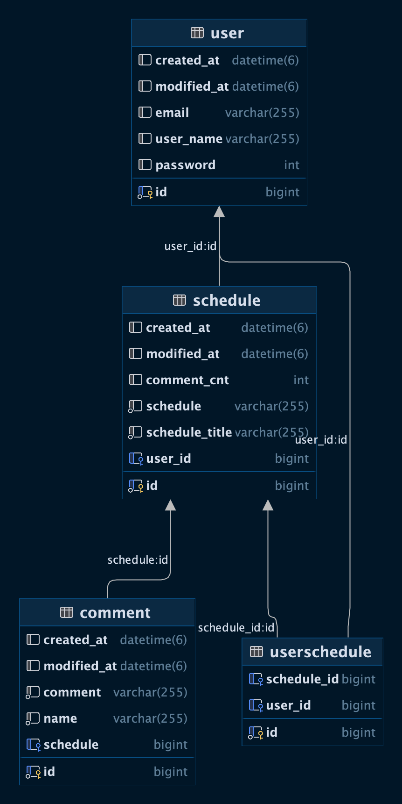

# README
스케줄 작성 프로그램 입니다.

jwt를 꼭 써보고 싶었는데 과제에 온전히 집중 할수 없었던것이 너무 아쉽습니다.

### Post /api/schedule/{id} 
### 할일 작성
request : scheduletTtle, schedule

### Get /api/schedule 
### 전체 조회
request : null;

### Get /api/schedule/{id}
### 단건 조회
request : id;

### Put /api/schedule/{id}
### 할일 수정

### Delete /api/schedule/{id}
### 스케줄 삭제

### Post /api/user
### 유저 저장
request : userName, email

### Post /api/comment/{id}
### 코멘트 저장
request : name, comment

ERD
